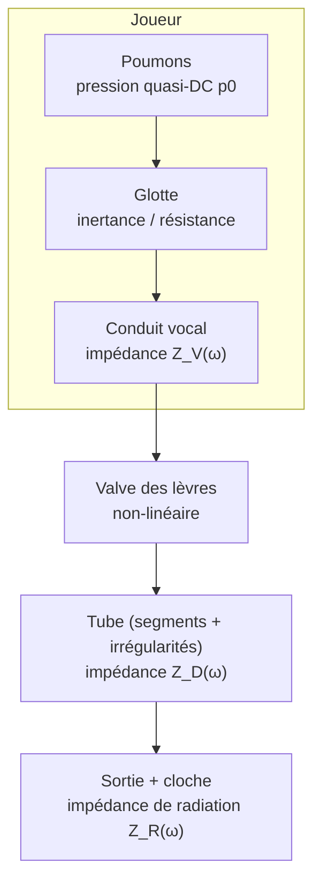

# Caractérisation géométrique, physique et musicale des didgeridoos en fonction des proportions du tube et des cloches

## Résumé exécutif

Les didgeridoos (yidakis) peuvent être décrits, à premier ordre, comme des conduits acoustiques (souvent irréguliers) proches d’un cône tronqué, excités par une **valve de lèvres** et terminés par une **sortie ouverte** dont le comportement dépend fortement de la présence/forme d’une **cloche** (évasement). Des mesures et modèles publiés montrent que, pour des instruments traditionnels typiques, la longueur est de l’ordre de 1,2–1,5 m et la fondamentale de jeu (drone) est souvent dans la plage ~50–80 Hz, avec un rapport de seconde résonance typiquement ~2,6–3,0 selon le profil d’alésage. citeturn11view0turn14view0turn12view1

La **musicalité perçue** (au sens “jouabilité / qualité” évaluée par des joueurs) est fortement corrélée à des grandeurs **mesurables** du système linéaire “tube + sortie” : en particulier, des études corrélant jugement et impédance d’entrée concluent que la **qualité** est **négativement corrélée** à la **magnitude de l’impédance acoustique d’entrée** en bande **1–2 kHz**, bande clé pour les **formants** idiomatiques (modulation de timbre par le conduit vocal). citeturn12view2turn15view0

Le point distinctif du didgeridoo, vis‑à‑vis de nombreux vents occidentaux, est le **couplage exceptionnellement fort** entre **conduit vocal** et **instrument** parce que l’instrument n’a pas de forte constriction de type embouchure/cuvette et présente une impédance caractéristique relativement faible : des maxima d’impédance du conduit vocal (souvent entre 1 et 3 kHz selon la configuration de langue) peuvent alors **inhiber** le débit acoustique entrant dans l’instrument à ces fréquences, créant des **minima** dans l’enveloppe spectrale et laissant apparaître des bandes renforcées (formants) ailleurs. citeturn11view0turn14view0turn12view2

Mathématiquement, la chaîne “joueur → valve → tube segmenté → cloche → champ rayonné” se traite efficacement par (i) une **équation 1D** de type **Webster** (ou variantes dissipatives), ou par une **modélisation en lignes de transmission / matrices de transfert** pour des assemblages de segments, (ii) une **condition de radiation** à la sortie via une **impédance de rayonnement** dépendant de la fréquence et de la géométrie de l’ouverture (et de la cloche), et (iii) un **exciteur non linéaire** (lèvres) couplé par l’impédance au résonateur. citeturn19view0turn13view0turn18view0turn23view0turn29view0

Enfin, du point de vue “design”, trois leviers géométriques ressortent de façon convergente dans la littérature citée ici : (a) **élargir** (en moyenne) le conduit et/ou intégrer une **cloche** tend à **réduire** les résonances d’impédance en bande 1–2 kHz et à **améliorer** la radiation dans cette bande, (b) l’**irrégularité** + les **pertes de paroi** modifient les facteurs de qualité (Q) des pics d’impédance, et (c) les **architectures multi‑segments** (marches, cônes tronqués, branches, résonateurs latéraux) permettent de sculpter localement l’impédance et donc les possibilités de timbre. citeturn15view0turn18view0turn3view4turn12view2

## Hypothèses, notation et paramètres géométriques

### Hypothèses explicites utilisées dans ce rapport

Ces hypothèses sont nécessaires pour donner des **formules paramétrées** (et pour savoir quand elles cessent d’être valides) :

- **Acoustique linéaire** dans le conduit pour l’établissement des **modes / impédances / fonctions de transfert** ; les non‑linéarités sont traitées séparément via le modèle de lèvres et, optionnellement, via une propagation non‑linéaire à forte amplitude. citeturn29view0turn23view0turn19view0  
- **Onde plane** (modèle 1D) tant que la fréquence reste sous la fréquence de coupure du premier mode transversal ; pour un conduit circulaire de rayon \(a\), une estimation standard est \(f_{10}\approx \dfrac{1{,}84\,c}{2\pi a}\). citeturn13view0  
- Parois supposées **rigides** (vitesse normale nulle), avec **pertes visco‑thermiques** modélisées soit par des paramètres effectifs (wavenumber complexe), soit par des modèles 1D dissipatifs (Zwikker‑Kosten, Webster‑Lokshin, etc.). citeturn18view0turn23view0  
- La **sortie** est modélisée par une **impédance de rayonnement** (complexe) qui capture la transition onde guidée → onde rayonnée, et introduit une **correction de longueur** (end correction). citeturn13view0turn18view0turn25view0  

### Notation géométrique minimale

On décrit l’axe longitudinal par \(x\in[0,L]\), avec \(x=0\) au niveau des lèvres (entrée), \(x=L\) à l’ouverture (sortie).

| Grandeur | Symbole | Définition | Valeur |
|---|---:|---|---|
| Longueur totale | \(L\) | Distance entrée → sortie | non spécifiée |
| Diamètre d’entrée | \(d_\mathrm{in}\) | Diamètre interne au point d’entrée | non spécifiée |
| Diamètre de sortie (avant cloche si cloche ajoutée) | \(d_\mathrm{out}\) | Diamètre interne à l’ouverture effective | non spécifiée |
| Aire de section | \(S(x)\) | \(S(x)=\pi r(x)^2\) si circulaire | non spécifiée |
| Rayon | \(r(x)\) | \(r(x)=d(x)/2\) | non spécifiée |
| Rapport d’évasement global | \(\eta\) | \(\eta=d_\mathrm{out}/d_\mathrm{in}\) | non spécifiée |
| Conicité linéaire | \(m\) | \(r(x)=r_0+m x\) (cône) | non spécifiée |
| Segments (assemblage) | \(L_i\) | Longueur du segment \(i\) | non spécifiée |
| Diamètres segment \(i\) | \(d_{i,1},d_{i,2}\) | aux extrémités du segment | non spécifiée |
| Épaisseur de paroi | \(t_w\) | épaisseur géométrique du matériau | non spécifiée |
| Longueur de cloche | \(L_b\) | portion évasée terminale | non spécifiée |
| Profil de cloche | \(r_b(x)\) | linéaire/exponentiel/puissance, etc. | non spécifiée |
| Angle (cloche conique) | \(\theta_b\) | \(\tan\theta_b = (r_e-r_t)/L_b\) | non spécifiée |

Plages typiques **indicatives** rapportées pour des instruments traditionnels (à ne pas confondre avec des “spécifications”) : longueur ~1,2–1,5 m ; diamètres internes souvent ~30–50 mm côté entrée et ~40–150 mm côté sortie. citeturn11view0turn8view0

### Géométries pertinentes à couvrir

- **Cylindre** : \(S(x)=S_0\).  
- **Cône tronqué** : \(r(x)=r_1+\dfrac{r_2-r_1}{L}x\).  
- **Section variable quelconque** (irrégularités naturelles) : \(S(x)\) mesurée ou reconstruite. citeturn11view0turn28view1  
- **Assemblage multi‑segments** : chaîne de cylindres/cônes tronqués, jonctions (marches), branches (didjeriduo), résonateurs latéraux. citeturn3view4turn15view0  
- **Cloche (évasement terminal)** : profil \(r_b(x)\) accélérant le rayon vers la sortie, modifiant la radiation et les pics d’impédance (surtout au‑delà de \(ka\sim 1\)). citeturn15view0turn13view0turn25view0  

## Modèles acoustiques linéaires du conduit

### Équations d’onde : 3D → 1D

Le point de départ est l’équation d’onde (ou Helmholtz en régime harmonique) dans le domaine 3D du conduit. Pour la pression \(p(\mathbf{x},t)\) dans un fluide homogène :

\[
\nabla^2 p - \frac{1}{c^2}\frac{\partial^2 p}{\partial t^2}=0,
\qquad
p(\mathbf{x},t)=\Re\{P(\mathbf{x})e^{j\omega t}\}
\Rightarrow
\nabla^2 P + k^2 P=0,\; k=\omega/c.
\]

Les parois rigides imposent \(\partial P/\partial n = 0\). citeturn19view0turn13view0

Sous hypothèse de section lentement variable et pression quasi uniforme sur la section, on obtient l’équation de Webster (forme fréquentielle) :

\[
\frac{1}{A(z)}\frac{d}{dz}\!\left(A(z)\frac{dP}{dz}\right)+k^2 P = 0,
\]

où \(A(z)\) est l’aire de section. citeturn19view0

Pour intégrer des **pertes visco‑thermiques**, des modèles 1D dissipatifs se formulent souvent en “équations des télégraphistes” (pression moyenne \(\hat p\), débit volumique \(\hat U\)) :

\[
\frac{d\hat p}{dx} + Z_v(\omega,x)\,\hat U = 0,
\qquad
\frac{d\hat U}{dx} + Y_t(\omega,x)\,\hat p = 0,
\]

avec des coefficients \(Z_v, Y_t\) dépendant du modèle choisi (Zwikker‑Kosten, Keefe, Webster‑Lokshin, etc.) et de la validité \(kR\ll 1\). citeturn23view0

### Modélisation “ligne de transmission” et matrices de transfert

En régime onde plane, l’impédance caractéristique d’une section \(S\) est :

\[
Z_c = \frac{\rho_0 c}{S}.
\]

Un segment uniforme de longueur \(\ell\) se représente par une matrice de transfert reliant \((P,U)\) entre ses extrémités :

\[
\begin{bmatrix}P(x_1)\\U(x_1)\end{bmatrix}
=
\begin{bmatrix}
\cos(k\ell) & jZ_c\sin(k\ell)\\
jZ_c^{-1}\sin(k\ell) & \cos(k\ell)
\end{bmatrix}
\begin{bmatrix}P(x_2)\\U(x_2)\end{bmatrix}.
\]

Cela permet de chaîner des éléments (cylindres, cônes tronqués, petites discontinuités) pour approximer un profil irrégulier. citeturn13view0turn15view0

### Modes propres et résonances : cylindres vs cônes tronqués

#### Cylindre (idéal, bouche “fermée” – sortie ouverte)

Si l’on approxime la sortie par une pression nulle (modèle très simplifié), un tube uniforme a des résonances proches de \(f_n\approx (2n-1)c/(4L)\). Une manière plus robuste est de passer par l’impédance d’entrée.

Avec une terminaison \(Z_L\) (radiation) à \(x=L\), l’impédance d’entrée est :

\[
Z_\mathrm{in}(\omega)=Z_c\,
\frac{Z_L + jZ_c\tan(kL)}{Z_c + jZ_L\tan(kL)}.
\]

Cette relation est la base des calculs d’impédance et de résonances par terminaison. citeturn13view0turn18view0

Dans le cas “tube supposé fermé à l’autre bout” utilisé comme coefficient de quadripôle dans l’analyse du système joueur‑instrument, on retrouve des expressions trigonométriques usuelles. Par exemple, une écriture classique des coefficients d’un cylindre idéal conduit à des termes en \(\cot(kL)\) et \(\csc(kL)\). citeturn18view0

#### Cône tronqué (forme standard du didgeridoo traditionnel)

Des travaux sur le didgeridoo modélisent fréquemment l’alésage comme un **cône tronqué** de diamètre \(d_1\) (entrée) à \(d_2\) (sortie). Pour une terminaison ouverte idéale, les maxima d’impédance d’entrée vérifient une condition implicite (écriture en nombre d’onde \(k_n\), longueur effective \(L' = L + 0{,}3\,d_2\)) :

\[
k_n L' = n\pi - \arctan\!\left(\frac{k_n d_1 L'}{d_2-d_1}\right).
\]

Les suites limites interpolent entre un cylindre (\(d_2=d_1\)) et un cône complet. citeturn17view0turn18view0

Pour une “petite évasure”, une approximation explicite rapportée est :

\[
\omega_n \approx \left(n-\frac12\right)\frac{\pi c}{2L'}\;
\left\{1+\left[1+\frac{4(d_2-d_1)}{\pi^2 d_1 (n-\tfrac12)^2}\right]^{-1}\right\}^{1/2}.
\]

Elle formalise la notion de **série quasi‑harmonique “étirée”** observée sur des yidakis. citeturn18view0turn11view0

### Pertes visco‑thermiques et rugosité / porosité

Deux effets sont particulièrement importants pour les didgeridoos : (i) des **pertes de paroi** plus fortes que dans des tubes lisses (rugosité, porosité), (ii) un alésage parfois large, rendant la radiation et les pertes de terminaisons plus audibles.

Une modélisation pragmatique utilisée dans l’analyse du système donne un nombre d’onde complexe \(k \simeq \omega/c - j\alpha\) avec une loi simple :

\[
\alpha \simeq 10^{-5}\,\beta\,\frac{\omega^{1/2}}{d},
\]

où \(\beta\) vaut environ 2,4 pour des parois lisses mais peut augmenter fortement avec la rugosité (cas “naturel”). citeturn18view0turn14view0

À un niveau plus général, les modèles visco‑thermiques modernes dérivent des équations linéarisées de Navier‑Stokes et montrent que les effets dissipatifs se concentrent dans des **couches limites** (épaisseur dépendante de \(\omega\)), qu’on remplace soit par des conditions aux limites effectives 3D, soit par des coefficients 1D (Zwikker‑Kosten, Webster‑Lokshin…). citeturn23view0turn20view1

### Sortie ouverte, cloche et impédance de rayonnement

La sortie ouverte impose une condition non triviale : l’onde guidée se couple au champ extérieur et la terminaison s’écrit par une **impédance de rayonnement** \(Z_R(\omega)=R_R+jX_R\). Son imaginaire \(X_R\) est lié à une **correction de longueur** \(\Delta L\) (la réflexion ne se produit pas exactement au plan de sortie). citeturn13view0turn25view0

Un développement basse fréquence (rayon \(a\), \(ka\ll 1\)) s’écrit typiquement sous la forme :

\[
Z_R \approx Z_c\left(\frac{(ka)^2}{4} + j\,k\,\Delta L\right),
\qquad \Delta L \approx 0{,}613\,a \;\;(\text{extrémité non bafflée}).
\]

On note que \(0{,}613a \approx 0{,}306d\), cohérent avec l’approximation \(L' = L + 0{,}3 d\) utilisée dans des modèles de didgeridoo. citeturn13view0turn17view0turn25view0

Une approximation alternative (en unités SI) utilisée dans l’analyse du didgeridoo donne, en fonction du diamètre de sortie \(d_2\) :

- si \(k d_2 \ll 1\) : \(Z_R \approx 7\times 10^{-4}\,\omega^2 + 0{,}5\,j\,\omega/d_2\)  
- si \(k d_2 \gg 1\) : \(Z_R \approx \rho c/A_2 \approx 500/d_2^2\). citeturn18view0

**Effet d’une cloche.** Une cloche agit comme un **transformateur d’impédance** plus progressif : elle favorise la radiation (moins de réflexion) à mesure que la fréquence monte, ce qui **affaiblit** les extrêmes de \(Z_\mathrm{in}(\omega)\) (pics plus bas, Q plus faible) au‑dessus d’une bande dépendant de \(r(x)\) et de la pente. Dans des travaux visant à améliorer un didgeridoo en PVC, l’ajout d’une **section évasée terminale** est présenté comme une stratégie efficace pour réduire l’impédance en 1–2 kHz, avec en plus garantissant une hausse du niveau sonore rayonné dans cette bande. citeturn15view0turn25view0

image_group{"layout":"carousel","aspect_ratio":"16:9","query":["traditional yidaki didgeridoo","didgeridoo bore profile cross section diagram","PVC didgeridoo with flared bell","modular didgeridoo multiple sections"],"num_per_query":1}

## Couplage joueur–instrument et non‑linéarités

### Schéma de système : deux résonateurs + une valve non linéaire

Le système complet inclut : poumons (source de pression), glotte, conduit vocal (résonateur amont), valve des lèvres (non linéaire), instrument (résonateur aval), radiation. Une synthèse expérimentale et théorique de ces interactions pour les vents, incluant le didgeridoo, est donnée par entity["people","Joe Wolfe","physicist acoustics"], entity["people","Neville H. Fletcher","physicist musical acoustics"] et entity["people","John Smith","researcher musical acoustics"], et insiste sur le rôle des **impédances** (bore + conduit vocal) “vues” par la valve et modulées par le joueur. citeturn16view0turn26view0



Ce type de description “réseau” est explicitement utilisé pour analyser le didgeridoo et relier variation de timbre et impédances. citeturn17view0turn14view0turn11view0

### Modèle de lèvres : oscillateur + Bernoulli + impédance du résonateur

Un modèle minimal classique (souvent utilisé pour les cuivres, pertinent conceptuellement pour une valve de lèvres) comporte trois équations : (i) un oscillateur mécanique 1 ddl pour l’ouverture \(h(t)\), (ii) un débit \(u(t)\) non linéaire par Bernoulli et fermeture \(h^+=\max(h,0)\), (iii) une relation pression‑débit via l’impédance d’entrée \(Z(\omega)\) du résonateur. citeturn29view0turn29view1

Une écriture représentative est :

\[
\ddot h + \frac{\omega_r}{Q_r}\dot h + \omega_r^2(h-h_0)= -\frac{p_m - p(t)}{\mu},
\]

\[
u(t)= w\,h^+(t)\sqrt{\frac{2}{\rho}\,|p_m-p(t)|}\,\mathrm{sign}(p_m-p(t)),
\]

\[
p(\omega)=Z(\omega)\,u(\omega),
\]

où \(p_m\) est la pression de bouche, \(w\) une largeur équivalente, \(\mu\) une masse surfacique, \(\omega_r,Q_r,h_0\) des paramètres d’embouchure. citeturn29view0

Pour le didgeridoo, des observations rapportent une fermeture des lèvres sur une fraction importante du cycle (environ la moitié), renforçant le contenu harmonique du débit, ce qui rend les formants plus “audibles” (analogie avec la phonation). citeturn18view0turn8view0

### Conduit vocal : impédance contrôlable et formants

Des mesures pendant jeu montrent que certaines configurations (langue haute proche du palais) produisent plusieurs maxima d’impédance du conduit vocal entre ~1–3 kHz ; ces maxima, si suffisamment élevés, réduisent le débit acoustique transmis vers l’instrument à ces fréquences et sculptent l’enveloppe spectrale (bandes inhibées vs bandes renforcées). citeturn11view0turn12view2

La clé est que l’effet est fort quand \(|Z_V|\) est **comparable** ou **supérieur** à \(|Z_D|\) dans cette zone : c’est justement une caractéristique du didgeridoo, dont \(Z_D\) est relativement bas à cause du diamètre et de l’absence de constriction de mouthpiece. citeturn11view0turn12view2turn8view0

### Vocalisations, battements, subharmoniques

La superposition “drone (lèvres)” + “voix (plis vocaux)” module le débit de façon essentiellement **multiplicative**, produisant des composantes \(m f_\mathrm{voix}\pm n f_\mathrm{drone}\) (tons de somme/différence, multiphoniques), et peut générer des **subharmoniques** du drone pour certains rapports de fréquences chantées. citeturn8view0turn14view0

## Correspondances géométrie → caractéristiques musicales et sonores

Cette section relie explicitement des **proportions du tube/cloche** à des descripteurs musicaux (hauteur, spectre, dynamique, modulations), en distinguant ce qui relève (i) du **résonateur** (linéaire, géométrique) et (ii) de l’**excitation** (joueur + non‑linéarités).

### Hauteur fondamentale, “note” de drone et modes supérieurs

**Principe:** dans les vents à valve, un régime de jeu stable apparaît souvent à une fréquence proche d’un extrémum d’impédance du bore ; la hauteur résultante dépend du bore *et* de l’ajustement de paramètres d’embouchure. citeturn26view0turn29view1

- **Longueur totale \(L\)** : c’est le levier dominant sur l’échelle de fréquences des résonances (via \(kL\)). Pour un conduit de longueur augmentée par correction de sortie, la fondamentale varie comme \(f\propto 1/L_\mathrm{eff}\). citeturn13view0turn17view0  
- **Diamètre de sortie et correction** : l’end correction augmente \(L_\mathrm{eff}\) d’une quantité \(\Delta L\) dépendant du rayon et de la terminaison (et donc de la cloche). citeturn13view0turn25view0  
- **Conicité \(\eta\)** : elle transforme la répartition des modes (et donc la localisation des résonances) entre la limite “cylindre” et “cône”, via les conditions sur \(k_n\). Les yidakis montrent souvent une série “quasi‑harmonique étirée”, cohérente avec un cône tronqué irrégulier et une longueur effective. citeturn11view0turn18view0  
- **Accents en modes supérieurs (“toot”)** : un saut momentané vers la seconde résonance est rapporté autour de 2,5–3 fois la fréquence de drone selon la forme d’alésage. citeturn14view0turn12view1  

### Spectre harmonique, “trou” spectral et rôle des jonctions

Les lèvres génèrent un signal riche en harmoniques (débit fortement non sinusoïdal, fermeture partielle). Le résonateur filtre et transforme l’impédance en efficacité de radiation.

Un fait rapporté dans l’analyse de qualité est l’existence possible d’un “trou” spectral : dans un cylindre simple, la série d’impédance 1:3:5 favorise certaines harmoniques, tandis que d’autres (2,4,6) sont plus faibles dans le rayonné ; dans des didgeridoos non cylindriques, le non‑alignement harmonique/résonances peut contribuer à une radiation moins efficace de certains harmoniques bas. citeturn12view1turn11view0

Les **jonctions** (marches de diamètre, cônes assemblés, branches) introduisent des réflexions partielles et des réorganisations de pics d’impédance. Dans un modèle multi‑segments, on quantifie l’effet via la chaîne de matrices de transfert (ou via conservation pression/débit aux jonctions). citeturn13view0turn3view4

### Timbre, formants et rôle central de la bande 1–2 kHz

Dans la pratique idiomatique, le timbre du didgeridoo est fortement associé à des **formants** modulables (analogie voyelles). Des mesures pendant jeu montrent : une configuration “langue haute” produit une forte modulation avec un formant souvent situé ~1,5–2 kHz, et l’enveloppe spectrale est reliée aux impédances du conduit vocal. citeturn11view0turn8view0

Du côté instrument, une étude de corrélations conclut que l’indicateur le plus important de “qualité” perçue est une **faible impédance d’entrée** en 1–2 kHz (les meilleurs instruments observés ayant des valeurs plus faibles que les instruments mal classés, en MPa·s·m\(^{-3}\)). citeturn12view2turn15view0

**Interprétation mécanique :** pour que le joueur puisse “imposer” des formants via \(Z_V(\omega)\), il faut que l’instrument ne présente pas déjà des pics élevés dans la même zone, sinon l’instrument “écrase” la commande du conduit vocal. C’est précisément l’argument utilisé pour expliquer la préférence de cloches et d’élargissements qui réduisent \(Z_D\) en 1–2 kHz. citeturn12view2turn15view0

### Attaque, décroissance, dynamique : rôle des pertes et des Q

En régime linéaire, chaque résonance peut être décrite par une fréquence \(f_n\) et un facteur de qualité \(Q_n\), lié à la largeur de bande \(\Delta f\) (approx. \(Q=f_n/\Delta f\)) et à un temps de décroissance typique (plus \(Q\) est grand, plus la résonance “sonne longtemps”). citeturn28view1turn27search4

Les pertes (visco‑thermiques, rugosité) et la cloche modifient \(Q_n\) :  
- **augmenter les pertes internes** réduit les pics de \(Z(f)\) mais peut réduire la loudness et perturber la sensation de “tenue” du drone ; sur un tube PVC, des tentatives d’augmenter l’amortissement interne ont réduit \(Z(f)\) au‑dessus de 1 kHz mais ont été jugées moins bonnes en qualité globale, notamment car l’instrument devenait moins fort et la fondamentale moins marquée. citeturn15view0  
- **ajouter une cloche** réduit les réflexions (et donc la formation d’ondes stationnaires) à haute fréquence et peut réduire \(Z(f)\) en 1–2 kHz tout en augmentant le niveau rayonné dans cette bande. citeturn15view0turn25view0  

### Résonances transversales et “2D/3D audible”

Les effets transversaux (modes non plans) deviennent pertinents lorsque les fréquences de jeu approchent la coupure. Pour un conduit circulaire, \(f_{10}\approx 1{,}84c/(2\pi a)\) ; ainsi, vers l’extrémité large d’un didgeridoo, ce seuil peut tomber dans la zone des kHz, précisément celle des formants contrôlés. Cela motive (i) des modèles enrichis ou (ii) une prudence d’interprétation quand on extrapole un modèle 1D jusqu’à 2–3 kHz. citeturn13view0turn23view0turn25view0

### Visualisations conceptuelles : impédance et spectre

**Courbes d’impédance d’entrée typiques (schéma conceptuel, log‑magnitude)**  
*(illustration qualitative des résultats rapportés : pics plus marqués pour cylindre, réduction en bande 1–2 kHz par cloche/élargissement)* citeturn12view2turn15view0

```
|Z_in(f)| (log)
  ^
  |          cylindre (PVC)
  |           /\     /\     /\           (pics forts jusque ~kHz)
  |          /  \   /  \   /  \
  |   cône  /    \_/    \_/    \__ ...
  |        /  (pics plus "étirés", souvent plus amortis)
  |  cloche + élargissement: pics atténués en 1–2 kHz
  |     _/\__   _/\__    _/\__          (pics "rabotés")
  +--------------------------------------------------> f
         0.1k   0.5k   1k   2k    5k
```

**Spectre rayonné : formants et inhibition**  
*(concept : maxima d’impédance du conduit vocal inhibent des bandes ; les formants apparaissent dans les bandes non inhibées)* citeturn11view0turn12view2turn14view0

```
Niveau (dB)
  ^
  |     enveloppe "langue haute"
  |        __        formant
  |       /  \__    ~1.5–2 kHz
  |  ____/      \____
  |      \__/\__/          <-- "creux" induits par Z_V élevé
  +-------------------------------> f
        harmoniques du drone (m f0)
```

## Méthodologie de mesure et protocoles expérimentaux

### Mesures recommandées

Pour relier proportions → caractéristiques sonores de façon contrôlée, il faut mesurer à la fois (A) **géométrie** et (B) **réponse acoustique** :

1. **Profil d’alésage \(S(x)\)**  
   - Mesure directe (outil de jauge interne, scan 3D/CT) ; ou reconstruction acoustique.  
   - La **réflectométrie impulsionnelle** (pulse reflectometry) injecte une impulsion, mesure les réflexions et reconstruit le profil interne ; elle est utilisée en vents et permet aussi de détecter des “fuites” (impostures géométriques acoustiques). citeturn28view1  

2. **Impédance d’entrée \(Z_\mathrm{in}(f)\)**  
   - Définition : ratio pression / débit volumique à l’entrée ; la mesure donne fréquences, amplitudes et Q des résonances. citeturn28view1turn12view1  
   - Mise en œuvre type “source de courant acoustique” + calibrations : synthèse multi‑harmonique injectée via haut‑parleur et guide d’onde de référence, calibrée par un “circuit ouvert” (bouchon rigide) et un conduit quasi‑infini (impédance ≈ réelle). Procédure explicitement décrite pour des didgeridoos et des yidakis, dont les auteurs utilisent un tube de calibration de diamètre ~26,2 mm et longueur ~194 m. citeturn11view0turn12view1turn3view4  

3. **Transpédance / transfert vers l’extérieur**  
   - Mesure de \(T(f)=p_\mathrm{ext}(f)/U_\mathrm{in}(f)\) pour relier l’impédance à la radiation ; utilisée notamment pour évaluer l’effet d’une cloche sur le niveau rayonné (même si la mesure en champ proche peut biaiser l’absolu). citeturn15view0  

4. **Mesures côté joueur** (pour relier géométrie ↔ commande)  
   - **Impédance du conduit vocal** près des lèvres pendant le jeu (sonde d’impédance) : difficile à cause du fort niveau sonore dans la bouche, mais démontré expérimentalement. citeturn11view0turn8view0  
   - **Pression statique de bouche** (manomètre à eau) pour normaliser les conditions de souffle, mentionnée dans les protocoles. citeturn11view0  
   - **Vidéo haute vitesse** des lèvres (ou stroboscopie) pour extraire la fraction de fermeture, l’aire d’ouverture, etc. citeturn11view0turn18view0  

### Paramètres de contrôle et protocole expérimental conseillé

Un protocole “géométrie → acoustique” robuste nécessite des conditions contrôlées :

- **Position d’embouchure** : même profondeur d’appui, même étanchéité (cire/embout), même orientation. citeturn11view0turn8view0  
- **Sortie libre** : distance à tout obstacle (sol, mur) pour éviter de modifier la radiation ; sinon, documenter la configuration (quasi‑baffle). citeturn25view0turn13view0  
- **Niveaux** : mesurer à plusieurs niveaux de souffle (pression) car l’excitation est non linéaire ; mais conserver un niveau “référence” (p.ex. drone stable) pour comparer les instruments. citeturn29view1turn11view0  
- **Bande de fréquence** : au moins jusqu’à 2–3 kHz pour capturer la bande formant (1–2 kHz) et les effets de cloche/assemblage ; documenter si le modèle 1D est poussé au-delà de sa zone de validité \(kR\ll 1\). citeturn23view0turn13view0turn12view2  

## Tableaux comparatifs et recommandations de conception

### Tableau comparatif de modèles géométriques typiques

Les “valeurs” sont laissées **non spécifiées** quand il s’agit d’un modèle générique ; les **effets attendus** sont ceux rapportés/compatibles avec les travaux cités.

| Modèle géométrique | Paramètres (non spécifiés si non donnés) | Modèle acoustique recommandé | Effets sonores attendus (liens) |
|---|---|---|---|
| Tube cylindrique long (PVC) | \(L\) non spécifiée, \(d\) non spécifiée, \(t_w\) non spécifiée | Onde plane + terminaison \(Z_R\) + matrices de transfert (trivial) | Série d’impédance proche 1:3:5 ; pics d’impédance élevés en bande kHz ; qualité perçue souvent faible ; harmoniques paires moins bien assistées, “trou” spectral possible. citeturn12view1turn15view0turn11view0 |
| Cône tronqué (approx. traditionnel) | \(L\), \(d_1\), \(d_2\), rugosité \(\beta\) non spécifiés | Formules de cône tronqué + radiation + pertes (\(\alpha\)) | Modes “étirés” ; \(f_2/f_1 \sim 2{,}6–3{,}0\) observé ; timbre modulable, résonances moins “verrouillantes” en 1–2 kHz selon design. citeturn18view0turn12view1turn11view0 |
| Profil irrégulier (termites) | \(S(x)\) non spécifiée | Discrétisation en segments + matrices de transfert ; validation par mesure \(Z(f)\) | Variabilité instrument‑à‑instrument ; pertes plus élevées (rugosité) ; répartition fine des pics d’impédance modifiant “réponse” aux formants du joueur. citeturn14view0turn18view0turn12view2 |
| Assemblage multi‑segments (marches, sections) | \(L_i,d_{i,1},d_{i,2}\) non spécifiés | Chaine de matrices de transfert + jonctions ; option : optimisation pour viser un \(Z(f)\) cible | Sculptage de \(Z(f)\) (pics supplémentaires ou atténués) ; possibilité de “caler” ou “dé‑caler” des résonances en 1–2 kHz pour faciliter les formants (ou au contraire les contrarier). citeturn13view0turn15view0 |
| Ajout d’une cloche (évasement) | \(L_b,r_t,r_e,\theta_b\) non spécifiés | Horn/Webster + \(Z_R\) amélioré ; mesure transpedance | Réduction des réflexions hautes fréquences ; baisse de \(Z\) en 1–2 kHz ; augmentation du niveau rayonné en 1–2 kHz ; amélioration de “qualité” attendue. citeturn15view0turn25view0turn13view0 |
| Didgeriduo (tube branché) | \(L_A,L_B,L_C,d_A,d_B,d_C\) non spécifiés | Réseau de guides d’onde + nœud (pressions égales, débits s’additionnent) + radiation | Nouvelles résonances ; peut offrir plusieurs “notes de pédale” et modifier subtilement la zone 1–2 kHz ; la fermeture/ouverture d’une branche change pitch et timbre. citeturn3view4 |
| Résonateurs latéraux (Helmholtz) | Volume & col non spécifiés, position \(x_r\) non spécifiée | Modèle de branche shunt (admittance) + matrices | Création de “trous” ciblés dans \(Z(f)\) (notches) ; utile pour diminuer l’impédance dans une bande précise (ex. 2,4 kHz) mais dépend fortement de la position relative aux nœuds de pression. citeturn15view0 |

### Formules “prêtes à paramétrer” par proportions

Les relations suivantes sont directement utilisables en design/fit, à condition de fournir les dimensions :

1. **Impédance caractéristique d’un segment circulaire**  
\[
Z_c=\frac{\rho c}{S}=\frac{4\rho c}{\pi d^2}.
\]
citeturn13view0turn18view0

2. **Propagation d’impédance sur un segment**  
\[
Z(x_1)=Z_c\,\frac{j\tan(k\ell)+Z(x_2)/Z_c}{1+j(Z(x_2)/Z_c)\tan(k\ell)}.
\]
citeturn13view0

3. **Cône tronqué : condition des maxima & pertes**  
Utiliser les relations de cône tronqué (condition en arctan) et \(k\simeq \omega/c-j\alpha\), \(\alpha\propto \omega^{1/2}/d\). citeturn18view0turn17view0

4. **Radiation : basse fréquence et correction de longueur**  
\[
Z_R \approx Z_c\left(\frac{(ka)^2}{4}+jk\Delta L\right),\;\Delta L\approx0{,}613a.
\]
citeturn13view0turn25view0

5. **Modèle lèvres minimal couplé à \(Z(\omega)\)**  
Utiliser le triplet (oscillateur \(h\), Bernoulli \(u\), relation \(p=Zu\)). citeturn29view0

### Recommandations de conception basées sur les liens établis

Les recommandations ci‑dessous ne sont pas des “recettes” universelles, mais des **heuristiques compatibles** avec les corrélations publiées et les mécanismes physiques identifiés :

- Pour favoriser un didgeridoo “formant‑friendly” (timbre très modulable par le conduit vocal), viser une **impédance d’entrée faible** en **1–2 kHz**, par élargissement moyen, cloche, ou architectures qui “rabotent” les pics dans cette bande. citeturn12view2turn15view0  
- Une **cloche** est un moyen efficace car elle réduit la réflexion à la sortie et augmente la radiation en hautes fréquences, ce qui tend à abaisser les extrema de \(Z(f)\) et à augmenter le niveau rayonné en 1–2 kHz. citeturn15view0turn25view0  
- L’**amortissement interne** peut réduire \(Z(f)\) mais peut coûter en loudness et en sensation d’appui sur la fondamentale, donc à employer avec mesure et validation perceptive. citeturn15view0turn28view1  
- Les **résonateurs latéraux** (Helmholtz) et les **branches** sont des outils puissants de “sculpture spectrale” mais très sensibles à la position et à l’accord : ils doivent être conçus à partir de \(Z(f)\) mesuré/ciblé et vérifiés expérimentalement. citeturn15view0turn3view4  
- Pour aller au‑delà d’un modèle 1D simple au‑delà de 2 kHz (grands diamètres de sortie, profils rapides, cloches), valider soit par mesures (impédance + transpedance), soit par un modèle enrichi (Webster‑Lokshin / 3D avec conditions visco‑thermiques). citeturn23view0turn25view0turn13view0